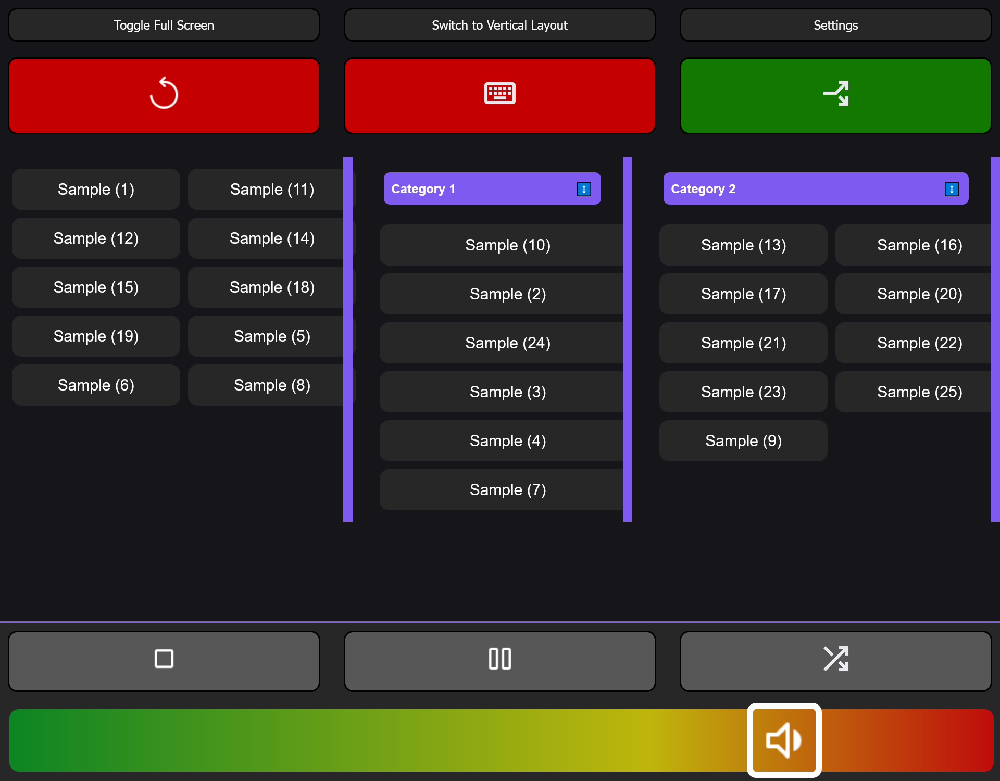

# Flask Web Soundboard
An HTML / Python Flask sound effect player
> 
*The soundboard interface as of version 0.1, 6-6-2025, in horizontal layout mode.*

---

## 📃 Description
This is a simple soundboard application built using Flask and HTML. 
It allows users to play sound effects by clicking on buttons. The intended
use is to have a separate device (like a phone or tablet) to play sound effects on,
but it can also be used on the same device as the server. The soundboard UI is hosted
on a web server, which can be accessed from any device on the same network.

---

## 🚀 Features at a Glance

### 🎵 Soundboard Essentials
- **Instant Playback:** Tap buttons to play sound effects.
- **Playback Controls:** Play, pause, stop, and adjust volume.
- **Randomizer:** Play a surprise sound with one click.
- **Looping:** Toggle repeat mode for any sound.
- **Multi-format Support:** Works with WAV, MP3, and OGG files.
- **Concurrent Playback:** Choose whether sounds overlap or interrupt.

### 🖌️ Customization & Layout
- **Organize Your Way:** Sort sounds by categories and reorder them.
- **Flexible Layouts:** Switch between vertical and horizontal modes.
- **Resizable Containers:** Adjust category widths to your liking.
- **Persistent Settings:** Layouts saved in your browser for next time.

### ⚡ Performance & Connectivity
- **Responsive Design:** Looks great on mobile and desktop.
- **Real-time Updates:** Low-latency server-client sync via Socket.IO.
- **Multi-device:** Use from any device on your network.

### 🛠️ Advanced Goodies
- **Push-to-Talk Integration:** Auto-presses F20 while playing (optional).
- **Smart Audio Routing:** Detects and uses VB-Cable if available.

---

## 🛣️ Planned Features
- Easy installation guide
- Settings menu for device and hotkey selection
- Custom push-to-talk key support

---

## 🐞 Known Issues
- Vertical layout needs improvement
- Category width adjustment buggy on mobile
- Category reordering issues
- "Uncategorized" category cannot be reordered

## 📚 References / Sources
UI Icons: https://fonts.google.com/icons  
PySDL2: https://pypi.org/project/PySDL2/0.9.2/  
Flask-SocketIO: https://flask-socketio.readthedocs.io/en/latest/  
Socket.IO: https://socket.io/docs/v4/
